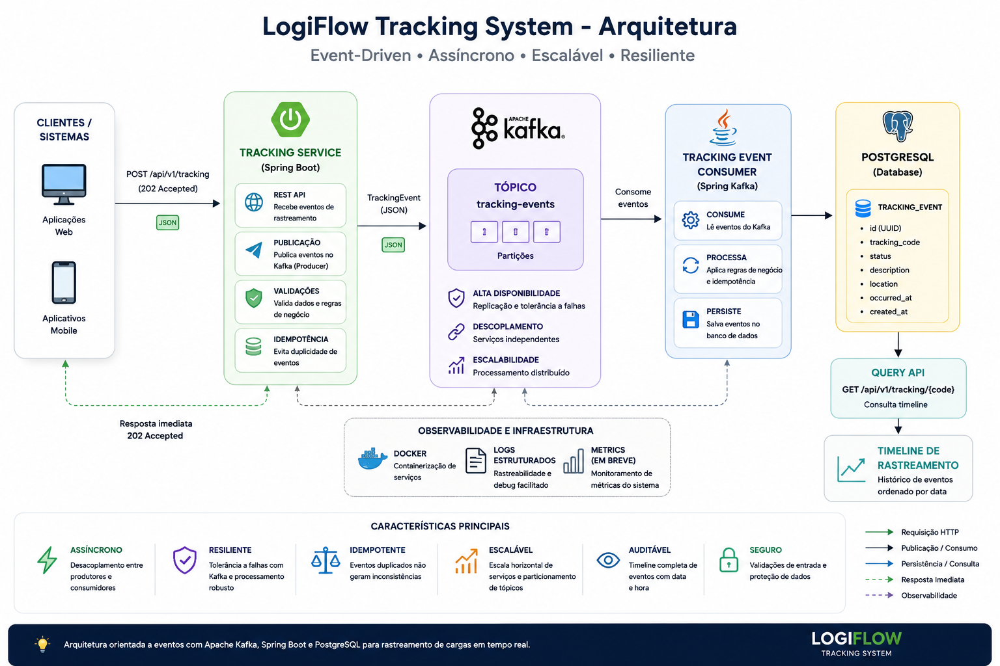
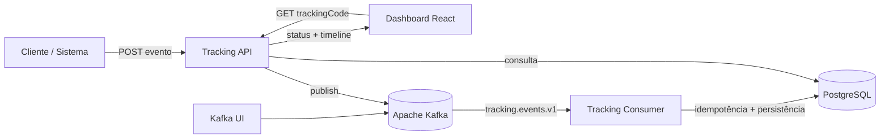

# 🚚 LogiFlow Tracking

> Plataforma de rastreamento logístico orientada a eventos com **Java 21, Spring Boot, Apache Kafka, PostgreSQL, Docker e React**.

<p align="left">
  
  
  
  
  
  
  
</p>


---

## 🎯 Sobre o projeto

O **LogiFlow Tracking** simula o núcleo de rastreamento de uma plataforma logística distribuída.

A API recebe eventos de movimentação, publica no **Apache Kafka** e responde com **HTTP 202 Accepted**. Um consumidor processa os eventos de forma assíncrona, aplica idempotência por `eventId` e persiste a timeline no **PostgreSQL**.

O projeto também possui um **dashboard React** que consulta a Tracking API e transforma os dados técnicos em uma experiência visual de rastreamento.

### Conceitos praticados

- arquitetura orientada a eventos;
- processamento assíncrono;
- consistência eventual;
- idempotência;
- mensageria com Kafka;
- REST APIs;
- PostgreSQL + Flyway;
- Docker Compose;
- React + Vite;
- CI com GitHub Actions.

---

## ✨ Destaques técnicos

- ✅ Java 21 + Spring Boot
- ✅ Apache Kafka Producer / Consumer
- ✅ Tópico `tracking.events.v1`
- ✅ HTTP `202 Accepted`
- ✅ Idempotência por `eventId`
- ✅ Timeline completa por código de rastreamento
- ✅ PostgreSQL + Flyway
- ✅ Docker Compose
- ✅ Spring Boot Actuator
- ✅ JUnit 5 + Mockito
- ✅ Dashboard React responsivo
- ✅ Busca por código de rastreio
- ✅ Status atual e localização
- ✅ Timeline visual de eventos
- ✅ Estados de loading e erro
- ✅ Backend CI + Frontend CI

---

## 🏗️ Arquitetura





### Fluxo de escrita

```text
Cliente / Microsserviço
        ↓
POST /api/tracking/events
        ↓
Tracking Service
        ↓
Apache Kafka
        ↓
Tracking Consumer
        ↓
Idempotência
        ↓
PostgreSQL
```

### Fluxo de consulta

```text
Dashboard React
      ↓
Código de rastreio
      ↓
GET /api/tracking/{trackingCode}
      ↓
Tracking Service
      ↓
PostgreSQL
      ↓
Status atual + Timeline
      ↓
Interface visual
```

---

# 🖥️ Dashboard Web

O dashboard fica em:

```text
dashboard-web/
```

A interface possui:

- campo para código de rastreio;
- status atual com destaque visual;
- código do pedido;
- última localização;
- data da última atualização;
- timeline cronológica;
- identificação do evento atual;
- tratamento de código não encontrado;
- loading visual;
- layout responsivo para desktop e mobile.

### Integração com o backend

Durante o desenvolvimento, o Vite encaminha:

```text
/api/*
```

para:

```text
http://localhost:8090
```

Assim, o frontend pode consultar:

```http
GET /api/tracking/{trackingCode}
```

sem precisar duplicar a URL do backend nos componentes.

---

## 🔄 Status de rastreamento

```text
PEDIDO_CRIADO
      ↓
PAGAMENTO_APROVADO
      ↓
ESTOQUE_RESERVADO
      ↓
EM_SEPARACAO
      ↓
EXPEDIDO
      ↓
EM_TRANSPORTE
      ↓
SAIU_PARA_ENTREGA
      ↓
ENTREGUE
```

Estados alternativos:

```text
ENTREGA_NAO_REALIZADA
CANCELADO
```

---

## 🧰 Stack

| Tecnologia | Papel |
|---|---|
| Java 21 | Backend |
| Spring Boot 3.5.16 | Framework backend |
| Spring Web | API REST |
| Spring Data JPA | Persistência |
| Spring for Apache Kafka | Producer e Consumer |
| Apache Kafka 3.9.1 | Mensageria |
| PostgreSQL 17 | Banco relacional |
| Flyway | Versionamento do schema |
| React 19 | Interface web |
| Vite 8 | Build e servidor frontend |
| Docker Compose | Infraestrutura local |
| Spring Boot Actuator | Health checks |
| JUnit 5 + Mockito | Testes backend |
| GitHub Actions | CI backend e frontend |

---

## 📁 Estrutura

```text
logiflow-tracking-system/
├── .github/
│   └── workflows/
│       ├── ci.yml
│       └── frontend-ci.yml
├── dashboard-web/
│   ├── src/
│   │   ├── App.jsx
│   │   ├── main.jsx
│   │   └── styles.css
│   ├── index.html
│   ├── package.json
│   └── vite.config.js
├── docs/
│   └── images/
├── tracking-service/
│   ├── Dockerfile
│   ├── pom.xml
│   └── src/
├── docker-compose.yml
├── pom.xml
├── requests.http
└── README.md
```

---

# 🚀 Como executar

## 1. Infraestrutura

Na raiz do projeto:

```bash
docker compose up -d postgres kafka kafka-ui
```

## 2. Backend

Pelo IntelliJ IDEA, execute:

```text
TrackingServiceApplication
```

ou:

```bash
cd tracking-service
mvn spring-boot:run
```

Backend:

```text
http://localhost:8090
```

Health check:

```text
http://localhost:8090/actuator/health
```

## 3. Dashboard React

Abra outro terminal na raiz:

```bash
cd dashboard-web
npm install
npm run dev
```

Acesse:

```text
http://localhost:5173
```

Depois informe um código existente, por exemplo:

```text
LF2026000145BR
```

---

## 🌐 Serviços locais

| Serviço | Endereço |
|---|---|
| Dashboard React | `http://localhost:5173` |
| Tracking API | `http://localhost:8090` |
| Health Check | `http://localhost:8090/actuator/health` |
| Kafka UI | `http://localhost:8091` |
| PostgreSQL | `localhost:5435` |
| Kafka | `localhost:9092` |

---

# 📡 API

## Publicar evento

```http
POST /api/tracking/events
Content-Type: application/json
```

```json
{
  "eventId": "64f16422-54aa-4e83-8dc3-78edfd9da001",
  "trackingCode": "LF2026000145BR",
  "orderId": "PED-2026-000145",
  "status": "PEDIDO_CRIADO",
  "city": "Sao Paulo",
  "state": "SP",
  "description": "Pedido criado e aguardando processamento",
  "occurredAt": "2026-08-12T08:35:00Z"
}
```

Resposta assíncrona:

```text
202 Accepted
```

## Consultar rastreamento

```http
GET /api/tracking/LF2026000145BR
```

```json
{
  "trackingCode": "LF2026000145BR",
  "orderId": "PED-2026-000145",
  "currentStatus": "EM_TRANSPORTE",
  "currentCity": "Guarulhos",
  "currentState": "SP",
  "lastUpdate": "2026-08-12T10:00:00Z",
  "history": [
    {
      "status": "PEDIDO_CRIADO",
      "city": "Sao Paulo",
      "state": "SP",
      "description": "Pedido criado e aguardando processamento",
      "occurredAt": "2026-08-12T08:35:00Z"
    },
    {
      "status": "EM_TRANSPORTE",
      "city": "Guarulhos",
      "state": "SP",
      "description": "Pedido enviado ao centro de distribuicao",
      "occurredAt": "2026-08-12T10:00:00Z"
    }
  ]
}
```

---

# ⚙️ CI

## Backend

```text
.github/workflows/ci.yml
```

Executa build e testes Maven com Java 21.

## Frontend

```text
.github/workflows/frontend-ci.yml
```

Executa:

```bash
npm install
npm run build
```

com Node.js 22.

---

## 🗺️ Roadmap

### Sprint 1 — Core Tracking ✅

- [x] Spring Boot
- [x] PostgreSQL + Flyway
- [x] Kafka Producer / Consumer
- [x] Timeline de eventos
- [x] Idempotência
- [x] Docker Compose
- [x] Health check
- [x] Teste unitário inicial

### Sprint 2 — Resiliência e integração

- [ ] `correlationId`
- [ ] Retry controlado
- [ ] Dead Letter Topic
- [ ] Logs estruturados
- [ ] Testcontainers
- [ ] Integração com outros serviços

### Sprint 3 — Experiência do usuário

- [x] Dashboard React
- [x] Busca por código de rastreio
- [x] Status atual
- [x] Timeline visual
- [x] Layout responsivo
- [ ] Screenshot oficial no README
- [ ] Atualização em tempo real com SSE ou WebSocket
- [ ] Mapa de movimentações
- [ ] Previsão de entrega
- [ ] Notificações

### Sprint 4 — Arquitetura avançada

- [ ] Transactional Outbox
- [ ] Redis
- [ ] API Gateway
- [ ] Segurança
- [ ] Observabilidade

---

## 🎓 Conceitos demonstrados

`Java 21` · `Spring Boot` · `REST API` · `Kafka` · `Event-Driven Architecture` · `PostgreSQL` · `JPA` · `Flyway` · `Docker` · `React` · `Vite` · `Idempotência` · `Processamento Assíncrono` · `Consistência Eventual` · `CI/CD`

---

## 📌 Status

🚧 **Em desenvolvimento ativo.** O núcleo backend e a primeira versão do dashboard web estão funcionais. As próximas etapas concentram-se em resiliência, atualização em tempo real, mapa e observabilidade.
