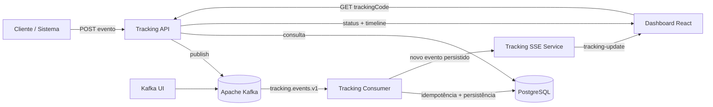
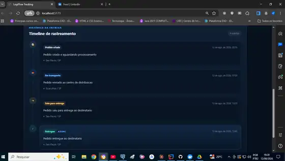

# 🚚 LogiFlow Tracking

> Plataforma de rastreamento logístico orientada a eventos com **Java 21, Spring Boot, Apache Kafka, PostgreSQL, Docker, React e Server-Sent Events (SSE)**.

<p align="left">
  
  
  
  
  
  
  
  
</p>


---

## 🎯 Sobre o projeto

O **LogiFlow Tracking** simula o núcleo de rastreamento de uma plataforma logística distribuída.

A API recebe eventos de movimentação, publica no **Apache Kafka** e responde com **HTTP 202 Accepted**. Um consumidor processa os eventos de forma assíncrona, aplica idempotência por `eventId` e persiste a timeline no **PostgreSQL**.

O projeto também possui um **dashboard React** que consulta a Tracking API e mantém uma conexão **Server-Sent Events (SSE)** aberta. Quando um novo evento é persistido, o backend publica a timeline atualizada e o React altera a tela automaticamente, sem polling e sem nova busca manual.

### Conceitos praticados

- arquitetura orientada a eventos;
- processamento assíncrono;
- consistência eventual;
- idempotência;
- mensageria com Kafka;
- REST APIs;
- atualização em tempo real com SSE;
- EventSource no frontend;
- PostgreSQL + Flyway;
- Docker Compose;
- React + Vite;
- CI com GitHub Actions.

---

## ✨ Destaques técnicos

- ✅ Java 21 + Spring Boot
- ✅ Apache Kafka Producer / Consumer
- ✅ Tópico `tracking.events.v1`
- ✅ HTTP `202 Accepted`
- ✅ Idempotência por `eventId`
- ✅ Timeline completa por código de rastreamento
- ✅ PostgreSQL + Flyway
- ✅ Docker Compose
- ✅ Spring Boot Actuator
- ✅ JUnit 5 + Mockito
- ✅ Dashboard React responsivo
- ✅ Busca por código de rastreio
- ✅ Status atual e localização
- ✅ Timeline visual de eventos
- ✅ Server-Sent Events (SSE)
- ✅ EventSource no React
- ✅ Atualização automática da timeline
- ✅ Indicador de conexão em tempo real
- ✅ Estados de loading, erro e reconexão
- ✅ Backend CI + Frontend CI

---

## 🏗️ Arquitetura




### Fluxo em tempo real

```text
Novo evento
    ↓
Apache Kafka
    ↓
Tracking Consumer
    ↓
PostgreSQL
    ↓
TrackingSseService
    ↓
Server-Sent Events
    ↓
EventSource / React
    ↓
Timeline atualizada automaticamente
```

---

# 🖥️ Dashboard Web

A interface possui:

- campo para código de rastreio;
- status atual com destaque visual;
- código do pedido;
- última localização;
- data da última atualização;
- timeline cronológica;
- identificação do evento atual;
- indicador de atualização em tempo real;
- reconexão automática do EventSource;
- tratamento de código não encontrado;
- loading visual;
- layout responsivo para desktop e mobile.

## ⚡ Atualização em tempo real com SSE

Depois que um código de rastreamento é carregado, o React abre uma conexão com:

```http
GET /api/tracking/{trackingCode}/stream
Accept: text/event-stream
```

O backend mantém a inscrição por `trackingCode`. Quando o Consumer persiste um novo evento válido, o `TrackingSseService` envia um evento chamado:

```text
tracking-update
```

O navegador recebe esse evento por `EventSource` e substitui os dados da tela automaticamente.

### Screenshot do fluxo validado

O cenário abaixo foi validado com a sequência **PEDIDO_CRIADO → EM_TRANSPORTE → SAIU_PARA_ENTREGA → ENTREGUE**. O último evento chegou pela arquitetura assíncrona e a interface exibiu **4 eventos** na timeline.



Durante o desenvolvimento, o Vite encaminha `/api/*` para `http://localhost:8090`, permitindo que o frontend use REST e SSE sem duplicar a URL do backend nos componentes.

---

## 🔄 Status de rastreamento

```text
PEDIDO_CRIADO
      ↓
PAGAMENTO_APROVADO
      ↓
ESTOQUE_RESERVADO
      ↓
EM_SEPARACAO
      ↓
EXPEDIDO
      ↓
EM_TRANSPORTE
      ↓
SAIU_PARA_ENTREGA
      ↓
ENTREGUE
```

Estados alternativos: `ENTREGA_NAO_REALIZADA` e `CANCELADO`.

---

## 🧰 Stack

| Tecnologia | Papel |
|---|---|
| Java 21 | Backend |
| Spring Boot 3.5.16 | Framework backend |
| Spring Web | REST API e SSE |
| Spring Data JPA | Persistência |
| Spring for Apache Kafka | Producer e Consumer |
| Apache Kafka 3.9.1 | Mensageria |
| PostgreSQL 17 | Banco relacional |
| Flyway | Versionamento do schema |
| SseEmitter | Publicação de eventos em tempo real |
| React 19 | Interface web |
| EventSource | Consumo do stream SSE |
| Vite 8 | Build e servidor frontend |
| Docker Compose | Infraestrutura local |
| Spring Boot Actuator | Health checks |
| JUnit 5 + Mockito | Testes backend |
| GitHub Actions | CI backend e frontend |

---

## 📁 Estrutura

```text
logiflow-tracking-system/
├── .github/workflows/
│   ├── ci.yml
│   └── frontend-ci.yml
├── dashboard-web/
│   └── src/
│       ├── App.jsx
│       ├── main.jsx
│       ├── realtime.css
│       └── styles.css
├── docs/images/
│   ├── logiflow-tracking-architecture.png
│   └── logiflow-dashboard-realtime.webp
├── tracking-service/
│   └── src/main/java/br/com/logiflow/tracking/
│       ├── controller/
│       ├── kafka/
│       ├── repository/
│       └── service/
│           ├── TrackingCommandService.java
│           ├── TrackingQueryService.java
│           └── TrackingSseService.java
├── docker-compose.yml
├── pom.xml
├── requests.http
└── README.md
```

---

# 🚀 Como executar

## 1. Infraestrutura

```bash
docker compose up -d postgres kafka kafka-ui
```

## 2. Backend

Pelo IntelliJ IDEA, execute `TrackingServiceApplication`, ou:

```bash
cd tracking-service
mvn spring-boot:run
```

Backend: `http://localhost:8090`

Health check: `http://localhost:8090/actuator/health`

## 3. Dashboard React

```bash
cd dashboard-web
npm install
npm run dev
```

Acesse `http://localhost:5173` e informe um código existente, por exemplo `LF2026000145BR`.

Quando a conexão SSE estiver ativa, o dashboard exibirá **Atualização em tempo real**.

---

## 🌐 Serviços locais

| Serviço | Endereço |
|---|---|
| Dashboard React | `http://localhost:5173` |
| Tracking API | `http://localhost:8090` |
| SSE Stream | `http://localhost:8090/api/tracking/{trackingCode}/stream` |
| Health Check | `http://localhost:8090/actuator/health` |
| Kafka UI | `http://localhost:8091` |
| PostgreSQL | `localhost:5435` |
| Kafka | `localhost:9092` |

---

# 📡 API

## Publicar evento

```http
POST /api/tracking/events
Content-Type: application/json
```

```json
{
  "eventId": "64f16422-54aa-4e83-8dc3-78edfd9da004",
  "trackingCode": "LF2026000145BR",
  "orderId": "PED-2026-000145",
  "status": "ENTREGUE",
  "city": "Sao Paulo",
  "state": "SP",
  "description": "Pedido entregue ao destinatario",
  "occurredAt": "2026-08-12T15:45:00Z"
}
```

Resposta: `202 Accepted`.

## Consultar rastreamento

```http
GET /api/tracking/LF2026000145BR
```

Exemplo do cenário validado:

```json
{
  "trackingCode": "LF2026000145BR",
  "orderId": "PED-2026-000145",
  "currentStatus": "ENTREGUE",
  "currentCity": "Sao Paulo",
  "currentState": "SP",
  "lastUpdate": "2026-08-12T15:45:00Z",
  "history": [
    { "status": "PEDIDO_CRIADO" },
    { "status": "EM_TRANSPORTE" },
    { "status": "SAIU_PARA_ENTREGA" },
    { "status": "ENTREGUE" }
  ]
}
```

## Assinar atualizações em tempo real

```http
GET /api/tracking/LF2026000145BR/stream
Accept: text/event-stream
```

Eventos SSE publicados:

```text
connected
tracking-update
```

---

# ⚙️ CI

O backend executa `mvn clean verify` com Java 21 e o frontend executa `npm install` + `npm run build` com Node.js 22 via GitHub Actions.

A implementação de SSE foi desenvolvida em feature branch, validada pelos dois pipelines e integrada por Pull Request.

---

## 🗺️ Roadmap

### Sprint 1 — Core Tracking ✅

- [x] Spring Boot
- [x] PostgreSQL + Flyway
- [x] Kafka Producer / Consumer
- [x] Timeline de eventos
- [x] Idempotência
- [x] Docker Compose
- [x] Health check
- [x] Teste unitário inicial

### Sprint 2 — Resiliência e integração

- [ ] `correlationId`
- [ ] Retry controlado
- [ ] Dead Letter Topic
- [ ] Logs estruturados
- [ ] Testcontainers
- [ ] Integração com outros serviços

### Sprint 3 — Experiência do usuário ✅

- [x] Dashboard React
- [x] Busca por código de rastreio
- [x] Status atual
- [x] Timeline visual
- [x] Layout responsivo
- [x] Screenshot oficial no README
- [x] Atualização em tempo real com SSE
- [x] Indicador de conexão / reconexão
- [ ] Mapa de movimentações
- [ ] Previsão de entrega
- [ ] Notificações

### Sprint 4 — Arquitetura avançada

- [ ] Transactional Outbox
- [ ] Redis
- [ ] API Gateway
- [ ] Segurança
- [ ] Observabilidade

---

## 🎓 Conceitos demonstrados

`Java 21` · `Spring Boot` · `REST API` · `Kafka` · `Event-Driven Architecture` · `PostgreSQL` · `JPA` · `Flyway` · `Docker` · `React` · `Vite` · `Server-Sent Events` · `EventSource` · `Idempotência` · `Processamento Assíncrono` · `Consistência Eventual` · `Realtime UI` · `CI/CD`

---

## 📌 Status

🚧 **Em desenvolvimento ativo.** O núcleo de tracking, o dashboard React e a atualização em tempo real via SSE estão funcionais e validados ponta a ponta. As próximas etapas concentram-se em resiliência, integração entre serviços, mapa e observabilidade.
