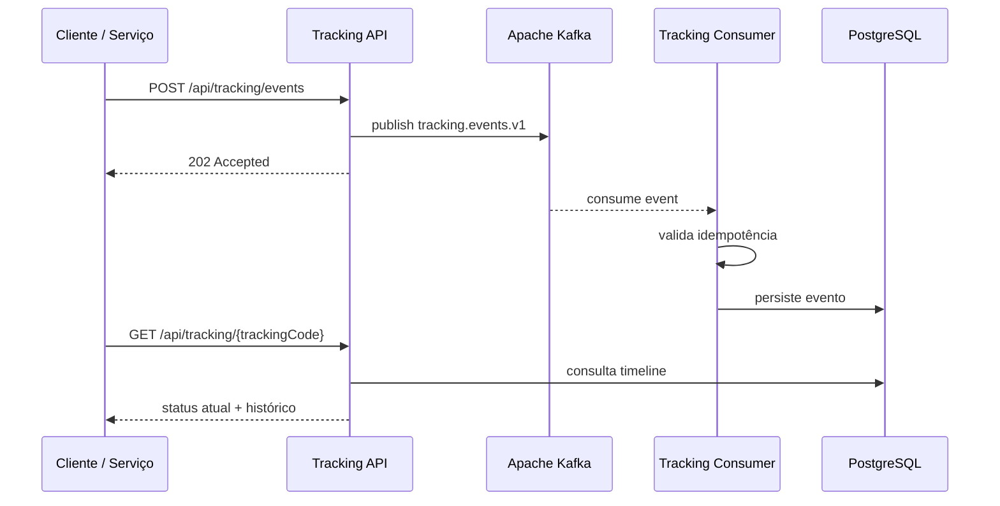
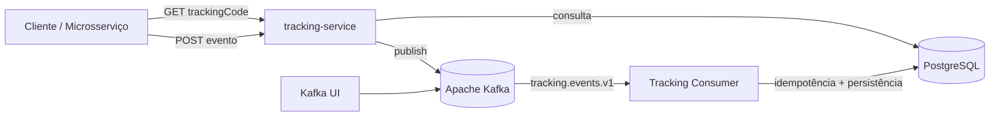

# 🚚 LogiFlow Tracking

> Sistema de rastreamento logístico orientado a eventos com **Java 21, Spring Boot, Apache Kafka, PostgreSQL e Docker**.

<p align="left">
  
  
  
  
  
  
</p>

## 🎯 Sobre o projeto

O **LogiFlow Tracking** simula o núcleo de rastreamento de uma plataforma logística distribuída. Em vez de persistir alterações de status diretamente no controller, a API recebe o evento, publica no Kafka e retorna **HTTP 202 Accepted**. Um consumidor processa o evento de forma assíncrona, aplica idempotência por `eventId` e persiste a timeline no PostgreSQL.

O objetivo é explorar conceitos usados em backends modernos e sistemas distribuídos, como:

- arquitetura orientada a eventos;
- processamento assíncrono;
- consistência eventual;
- idempotência;
- mensageria com Kafka;
- migrations versionadas com Flyway;
- health checks e observabilidade básica;
- infraestrutura local reproduzível com Docker Compose.

## ✨ Destaques técnicos

- ✅ **Java 21 + Spring Boot** no backend
- ✅ **Apache Kafka** como backbone de eventos
- ✅ Producer e Consumer no tópico `tracking.events.v1`
- ✅ **HTTP 202 Accepted** para processamento assíncrono
- ✅ Idempotência baseada em `eventId`
- ✅ Timeline completa por código de rastreamento
- ✅ PostgreSQL + Flyway
- ✅ Docker Compose com health checks
- ✅ Spring Boot Actuator
- ✅ Teste unitário inicial com JUnit 5 e Mockito

## 🧠 Decisão arquitetural principal

O endpoint de escrita não persiste diretamente o evento. Ele publica a mensagem no Kafka e devolve `202 Accepted` ao cliente.

Isso desacopla a entrada da API do processamento definitivo e aproxima o projeto de um cenário real de integração entre microsserviços.



## 🏗️ Arquitetura


## 🏗️ Arquitetura

O diagrama abaixo apresenta a arquitetura do **LogiFlow Tracking System**, evidenciando o processamento assíncrono de eventos, a persistência da timeline de rastreamento e a integração entre os componentes principais da solução.


**Principais elementos da arquitetura:**
- **Clientes / Sistemas** enviam eventos de rastreamento;
- **Tracking Service** recebe a requisição REST e publica no Kafka;
- **Apache Kafka** desacopla produtores e consumidores;
- **Tracking Event Consumer** processa os eventos com idempotência;
- **PostgreSQL** persiste o histórico e o status atual;
- **Query API** consulta o código de rastreio e devolve a timeline.
## 🔄 Fluxo de rastreamento

Exemplo de evolução de um pedido:

```text
PEDIDO_CRIADO
      ↓
PAGAMENTO_APROVADO
      ↓
ESTOQUE_RESERVADO
      ↓
EM_SEPARACAO
      ↓
EXPEDIDO
      ↓
EM_TRANSPORTE
      ↓
SAIU_PARA_ENTREGA
      ↓
ENTREGUE
```

Também existem os estados `ENTREGA_NAO_REALIZADA` e `CANCELADO`.

## 🧰 Stack

| Tecnologia | Papel no projeto |
|---|---|
| Java 21 | Linguagem principal |
| Spring Boot 3.5.16 | Framework backend |
| Spring Web | API REST |
| Spring Data JPA | Persistência |
| Spring for Apache Kafka | Producer e Consumer |
| Apache Kafka 3.9.1 | Mensageria orientada a eventos |
| PostgreSQL 17 | Banco relacional |
| Flyway | Versionamento do schema |
| Docker Compose | Infraestrutura local |
| Spring Boot Actuator | Health checks e métricas |
| JUnit 5 + Mockito | Testes |

## 📁 Estrutura do projeto

```text
logiflow-tracking-system/
├── docker-compose.yml
├── pom.xml
├── requests.http
├── README.md
└── tracking-service/
    ├── Dockerfile
    ├── pom.xml
    └── src/
        ├── main/java/br/com/logiflow/tracking/
        │   ├── config/
        │   ├── controller/
        │   ├── dto/
        │   ├── entity/
        │   ├── kafka/
        │   ├── repository/
        │   └── service/
        ├── main/resources/
        │   ├── application.yml
        │   └── db/migration/
        └── test/
```

## 🚀 Como executar

### Pré-requisitos

- Java 21
- Maven 3.9+
- Docker Desktop com Docker Compose

### Opção 1 — tudo com Docker

Na raiz do projeto:

```bash
docker compose up --build
```

### Opção 2 — infraestrutura no Docker + backend na IDE

Suba PostgreSQL, Kafka e Kafka UI:

```bash
docker compose up -d postgres kafka kafka-ui
```

Depois execute `TrackingServiceApplication` pelo IntelliJ IDEA ou:

```bash
cd tracking-service
mvn spring-boot:run
```

## 🌐 Serviços locais

| Serviço | Endereço |
|---|---|
| Tracking API | `http://localhost:8090` |
| Health Check | `http://localhost:8090/actuator/health` |
| Kafka UI | `http://localhost:8091` |
| PostgreSQL | `localhost:5435` |
| Kafka | `localhost:9092` |

## ❤️ Health check

```bash
curl http://localhost:8090/actuator/health
```

Resposta esperada:

```json
{
  "status": "UP"
}
```

## 📡 API

### Publicar evento de rastreamento

```http
POST /api/tracking/events
Content-Type: application/json
```

Exemplo:

```json
{
  "eventId": "64f16422-54aa-4e83-8dc3-78edfd9da001",
  "trackingCode": "LF2026000145BR",
  "orderId": "PED-2026-000145",
  "status": "PEDIDO_CRIADO",
  "city": "Sao Paulo",
  "state": "SP",
  "description": "Pedido criado e aguardando processamento",
  "occurredAt": "2026-08-12T08:35:00Z"
}
```

Resposta:

```json
{
  "eventId": "64f16422-54aa-4e83-8dc3-78edfd9da001",
  "trackingCode": "LF2026000145BR",
  "status": "ACCEPTED",
  "message": "Evento enviado para processamento assíncrono"
}
```

### Consultar rastreamento

```http
GET /api/tracking/LF2026000145BR
```

Exemplo de resposta:

```json
{
  "trackingCode": "LF2026000145BR",
  "orderId": "PED-2026-000145",
  "currentStatus": "EM_TRANSPORTE",
  "currentCity": "Guarulhos",
  "currentState": "SP",
  "lastUpdate": "2026-08-12T10:00:00Z",
  "history": [
    {
      "eventId": "64f16422-54aa-4e83-8dc3-78edfd9da001",
      "status": "PEDIDO_CRIADO",
      "city": "Sao Paulo",
      "state": "SP",
      "description": "Pedido criado e aguardando processamento",
      "occurredAt": "2026-08-12T08:35:00Z"
    },
    {
      "eventId": "64f16422-54aa-4e83-8dc3-78edfd9da002",
      "status": "EM_TRANSPORTE",
      "city": "Guarulhos",
      "state": "SP",
      "description": "Pedido enviado ao centro de distribuicao",
      "occurredAt": "2026-08-12T10:00:00Z"
    }
  ]
}
```

## 🧪 Fluxo já validado localmente

O cenário abaixo já foi executado com sucesso durante o desenvolvimento:

```text
POST PEDIDO_CRIADO
        ↓
202 Accepted
        ↓
Kafka Producer
        ↓
tracking.events.v1
        ↓
Kafka Consumer
        ↓
PostgreSQL
        ↓
GET /api/tracking/LF2026000145BR
        ↓
PEDIDO_CRIADO → EM_TRANSPORTE
```

## 🗺️ Roadmap

### Sprint 1 — núcleo de tracking

- [x] Serviço Spring Boot
- [x] PostgreSQL + Flyway
- [x] Kafka Producer / Consumer
- [x] Timeline de eventos
- [x] Idempotência por `eventId`
- [x] Docker Compose
- [x] Health check
- [x] Teste unitário inicial

### Sprint 2 — resiliência e integração

- [ ] Integrar `pedido-service`
- [ ] Integrar `estoque-service`
- [ ] Integrar `expedicao-service`
- [ ] Dead Letter Topic
- [ ] Retry controlado
- [ ] `correlationId`
- [ ] Logs estruturados

### Sprint 3 — experiência do usuário

- [ ] Dashboard React
- [ ] Timeline visual
- [ ] Atualização em tempo real com SSE ou WebSocket
- [ ] Mapa de movimentações
- [ ] Previsão de entrega
- [ ] Notificações

### Sprint 4 — arquitetura avançada

- [ ] Transactional Outbox
- [ ] Redis
- [ ] API Gateway
- [ ] Segurança
- [ ] Testcontainers
- [ ] GitHub Actions / CI

## 🎓 Conceitos demonstrados

Este projeto foi pensado para demonstrar, na prática:

`Java` · `Spring Boot` · `REST API` · `Kafka` · `Event-Driven Architecture` · `PostgreSQL` · `JPA` · `Flyway` · `Docker` · `Idempotência` · `Processamento Assíncrono` · `Consistência Eventual` · `Testes`

## 📌 Status

🚧 **Em desenvolvimento ativo.** A primeira versão funcional do núcleo de rastreamento está concluída; as próximas etapas focam resiliência, integração entre serviços e experiência do usuário.
